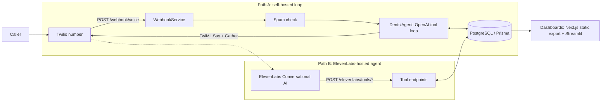

# Dentsi — AI Voice Agent for Dental Appointment Automation

Dentsi is a full-stack AI voice agent that answers a dental clinic's phone,
identifies the caller against patient records, triages symptoms, checks real
availability, and books, reschedules, or cancels appointments — writing every
call, transcript, and outcome to PostgreSQL. It is built for small dental
practices that miss calls outside front-desk hours, and ships with a staff
dashboard (Next.js, plus Streamlit variants), outbound reminder calling, and a
feedback/training-export pipeline for improving the agent over time.

## Architecture at a glance

**Orchestration pattern: single-agent tool loop.** One agent
(`DentsiAgentService`) drives an OpenAI chat-completions function-calling loop
with 18 tools (patient lookup/create, availability, booking, reschedule,
cancel, escalation, urgency triage, medical alerts, date validation/parsing,
sentiment). Each caller turn runs the loop until the model stops requesting
tools, capped at 5 iterations, after which the agent hands off to staff. A
rule-based sentiment pass runs before each turn; scheduling, triage, and spam
detection are deterministic services invoked as tools, not separate LLM
agents. An earlier multi-agent decomposition (voice/scheduler/policy/ops
services) remains in `src/agents/` for reference but is not in the live call
path.

- **Models/frameworks**: NestJS 11 + Prisma 6 (PostgreSQL) backend; OpenAI
  chat completions (`OPENAI_MODEL`, default `gpt-4`) for the agent loop;
  optional Deepgram `nova-2` STT and ElevenLabs `eleven_turbo_v2_5` TTS;
  Twilio for telephony. An alternative integration path hosts the whole voice
  loop on ElevenLabs Conversational AI (the deploy script provisions
  `gemini-2.0-flash` as its LLM), with the ElevenLabs agent calling back into
  this backend's `/elevenlabs/tools/*` endpoints.
- **Memory/session state**: per-call session objects in an in-process `Map`
  keyed by Twilio CallSid (system prompt + full turn history + booking
  state). On call end the transcript and outcome are persisted to the `call`
  table; nothing survives a process restart mid-call.
- **Retrieval**: no vector store. Context is assembled from SQL — the caller's
  phone number resolves to patient history, preferences, insurance, medical
  alerts, and upcoming appointments, rendered into the system prompt. The
  ElevenLabs path additionally uses the plain-text files in `knowledge_base/`
  as agent knowledge.

### Two voice pipelines



In Path A, Twilio's `<Gather input="speech dtmf">` does speech recognition and
the backend replies with TwiML (`Polly.Joanna-Generative` voice; ElevenLabs
file-based TTS and Deepgram transcription are wired in as optional
replacements). In Path B, ElevenLabs owns STT/LLM/TTS and this backend is the
system of record behind five webhook tools. Outbound reminder/recall calls run
on cron (`@nestjs/schedule`): a 5-minute processor and a daily 09:00 recall
check, with per-call retry (3 attempts, 2-hour backoff) and calling-hours
windows.

## Quickstart

Prerequisites: Node.js 18+, PostgreSQL, and API keys per the table below.

```bash
git clone https://github.com/git-bonda108/dentsi-autonomous-front-desk.git
cd dentsi-autonomous-front-desk/nodejs_space
npm install
cp .env.example .env         # fill in DATABASE_URL and API keys
npx prisma generate
npx prisma migrate dev
npx prisma db seed           # 3 demo clinics, 7 doctors, demo patients/services
npm run start:dev
```

Expected output once the app boots:

```
LOG [Bootstrap] 🚀 DENTRA Backend is running on: http://localhost:3000
LOG [Bootstrap] 📚 API Documentation: http://localhost:3000/api-docs
LOG [Bootstrap] 🎨 Dashboard UI: http://localhost:3000/dashboard/
```

Verify:

```bash
curl http://localhost:3000/health
# {"status":"ok","timestamp":"...","service":"DENTRA Backend","version":"1.0.0"}
```

Then open http://localhost:3000/dashboard/ (the committed static export) or
run a Streamlit app (`streamlit_demo/README.md`). To take real phone calls,
expose the server publicly and follow [TWILIO_SETUP.md](TWILIO_SETUP.md); for
the ElevenLabs-hosted path, follow [AGENT_PROMPT.md](AGENT_PROMPT.md) /
[ELEVENLABS_PROMPT.md](ELEVENLABS_PROMPT.md) and `elevenlabs-agent/`.
`scripts/setup.sh` automates the backend steps above.

## Configuration

All variables are read in `nodejs_space` (template: `nodejs_space/.env.example`).

| Variable | What it is | Where to get it |
|----------|------------|-----------------|
| `DATABASE_URL` | PostgreSQL connection string | Your database (local `createdb dentsi_db` or managed Postgres) |
| `TWILIO_ACCOUNT_SID` | Twilio account SID | console.twilio.com |
| `TWILIO_AUTH_TOKEN` | Twilio auth token | console.twilio.com |
| `TWILIO_PHONE_NUMBER` | Outbound caller ID number | A voice-enabled number in your Twilio account |
| `WEBHOOK_BASE_URL` | Public base URL Twilio calls back to (outbound-call TwiML) | Your deployment URL or ngrok tunnel |
| `BACKEND_URL` | Public base URL used when serving generated ElevenLabs audio files | Same as `WEBHOOK_BASE_URL` (not in `.env.example`; defaults to a legacy host if unset) |
| `OPENAI_API_KEY` | OpenAI key for the agent loop | platform.openai.com/api-keys |
| `OPENAI_MODEL` | Chat model for the agent loop (default `gpt-4`) | Your choice |
| `DEEPGRAM_API_KEY` | Optional STT (feature-flags Deepgram use) | console.deepgram.com |
| `ELEVENLABS_API_KEY` | Optional TTS / agent deploy script | elevenlabs.io |
| `ELEVENLABS_VOICE_ID` | ElevenLabs voice (default Rachel) | ElevenLabs voice library |
| `TRANSCRIPT_WEBHOOK_SECRET` | Optional shared secret required by `POST /transcript/*` writers (not in `.env.example`) | Generate any random string |
| `PORT` | HTTP port (default 3000) | — |
| `NODE_ENV` | `development` / `production` / `test` | — |
| `DEBUG` | Verbose logging flag | — |
| `CORS_ORIGINS` | Documented allowlist; note the current code enables CORS for all origins regardless | — |
| `ML_TRAINING_DATA_PATH` | Directory for exported fine-tune JSONL | — |
| `ML_MIN_CONVERSATION_LENGTH` | Minimum turns before a call is logged for training | — |
| `ML_AUTO_COLLECT` | Enable automatic training-data collection | — |

## Documentation

- [docs/ARCHITECTURE.md](docs/ARCHITECTURE.md) — component map, data flow, orchestration analysis, design trade-offs
- [docs/EVALUATION.md](docs/EVALUATION.md) — what is actually tested, edge cases handled in code, proposed evaluation harness
- [docs/HARDENING.md](docs/HARDENING.md) — current security posture and the ladder to production (including the health-data posture)
- [SETUP_GUIDE.md](SETUP_GUIDE.md) — step-by-step environment setup
- [TWILIO_SETUP.md](TWILIO_SETUP.md) — phone number and webhook wiring
- [AGENT_PROMPT.md](AGENT_PROMPT.md) / [ELEVENLABS_PROMPT.md](ELEVENLABS_PROMPT.md) — ElevenLabs agent prompts and tool configuration
- [PROJECT_DOCUMENTS/](PROJECT_DOCUMENTS/) — original project plan and MVP feature spec
- [nodejs_space/docs/MVP_TEST_CASES.md](nodejs_space/docs/MVP_TEST_CASES.md) — manual test-case specification
